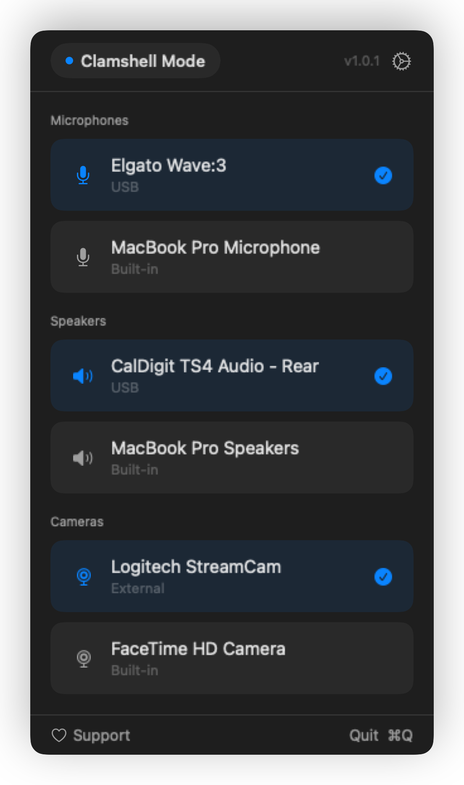

<div align="center">
<h1>🎛️ Switchboard</h1>


<p>Auto-switch audio and video devices when you dock your Mac</p>
</div>

---

<p align="center">
  
</p>

Switchboard is a menu bar app that monitors your lid state and connected peripherals — then picks the right mic, camera, and audio output so you don't have to.

## Install

**Homebrew** (recommended):
```bash
brew install --cask maferland/tap/switchboard
```

**Manual**: Download DMG from [Releases](https://github.com/maferland/switchboard/releases), open it, drag `Switchboard.app` to Applications.

**Build from source**:
```bash
git clone https://github.com/maferland/switchboard.git
cd switchboard
make install
```

## Usage

Run `Switchboard`. A swap icon appears in your menu bar showing the current mode.

- **Click** — Popover with current mode (Laptop / Clamshell), active devices, and settings
- **Priority lists** — Each mode has a priority list per category (mic, output, camera). First available wins, falls back to built-in.
- **Drag to reorder** — Customize priorities in Settings
- **Start at Login** — Run automatically when you log in
- **Quit** — ⌘Q

### Config

Stored at `~/.config/switchboard/config.json`.

```json
{
  "laptopMic": ["MacBook Pro Microphone"],
  "laptopOutput": ["CalDigit TS4 Audio - Rear", "MacBook Pro Speakers"],
  "clamshellMic": ["Elgato Wave:3"],
  "clamshellOutput": ["CalDigit TS4 Audio - Rear"]
}
```

## Privacy

No analytics, no tracking, no network requests. All data stays on device.

## Requirements

- macOS 14 (Sonoma) or later
- Microphone permission (monitors devices, doesn't record)
- Camera permission (detects cameras)

## Support

If Switchboard saves you from fiddling with Sound settings, consider buying me a coffee:

[](https://buymeacoffee.com/maferland)

## License

MIT — see [LICENSE](LICENSE)
